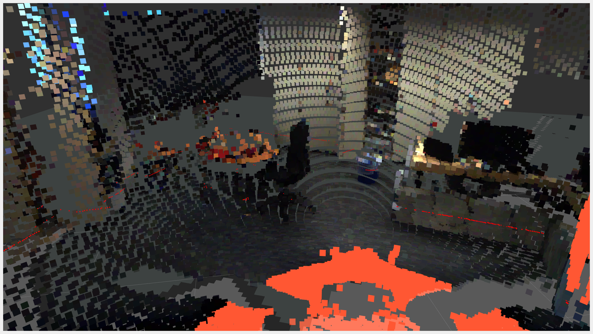
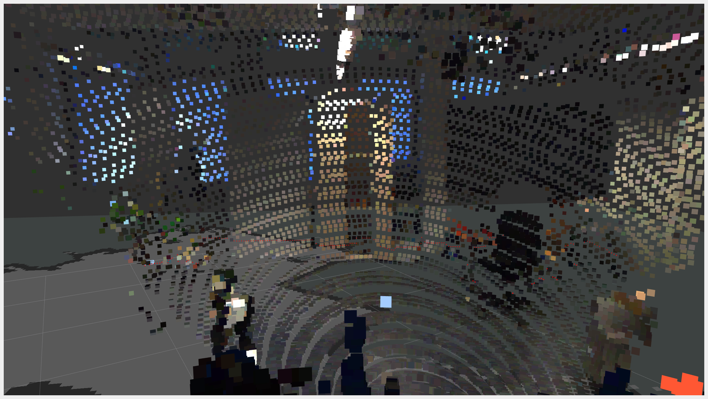
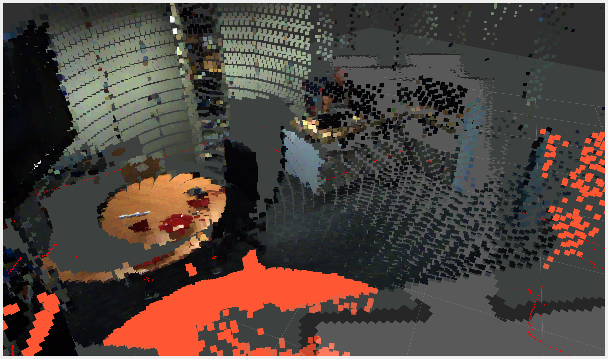
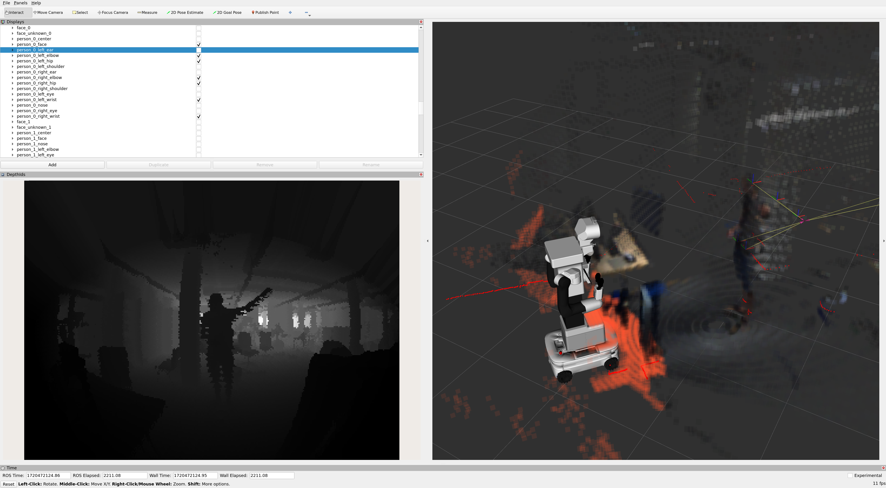
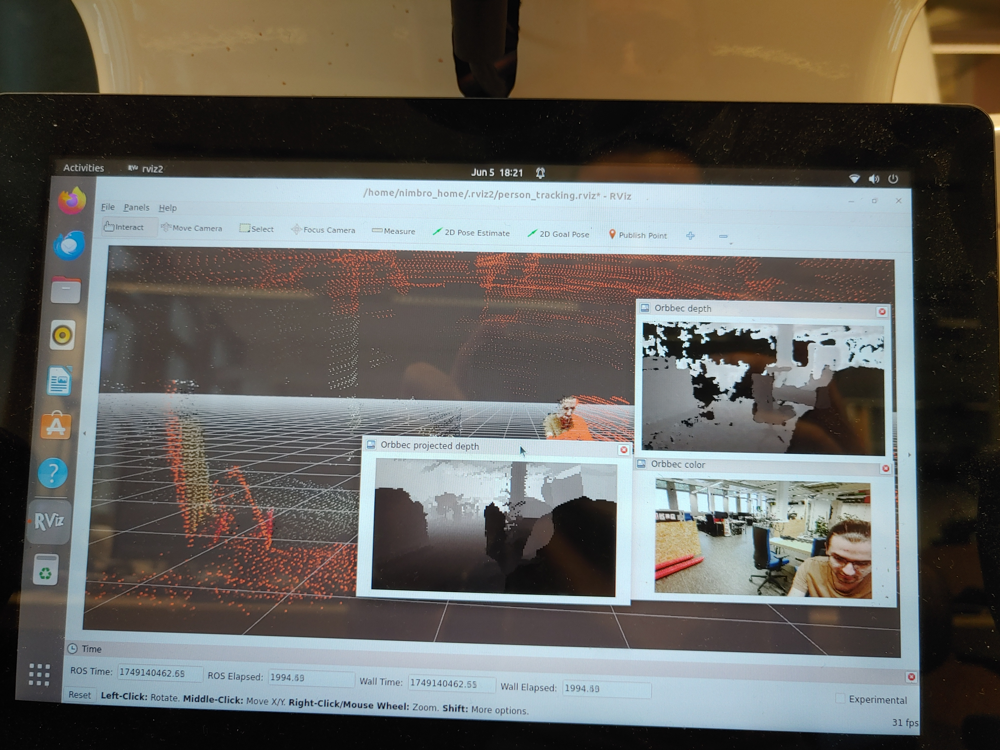
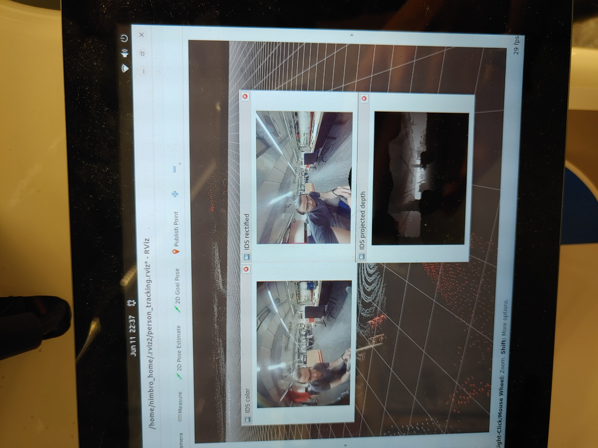
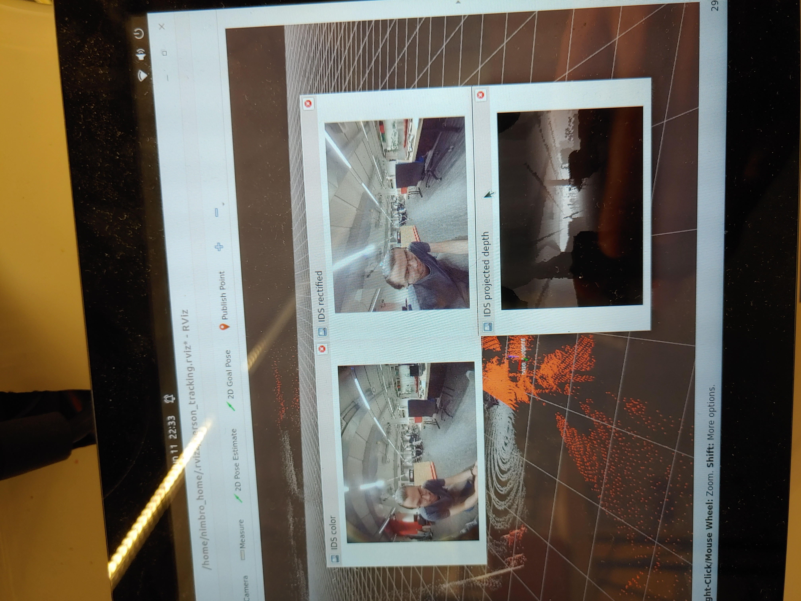
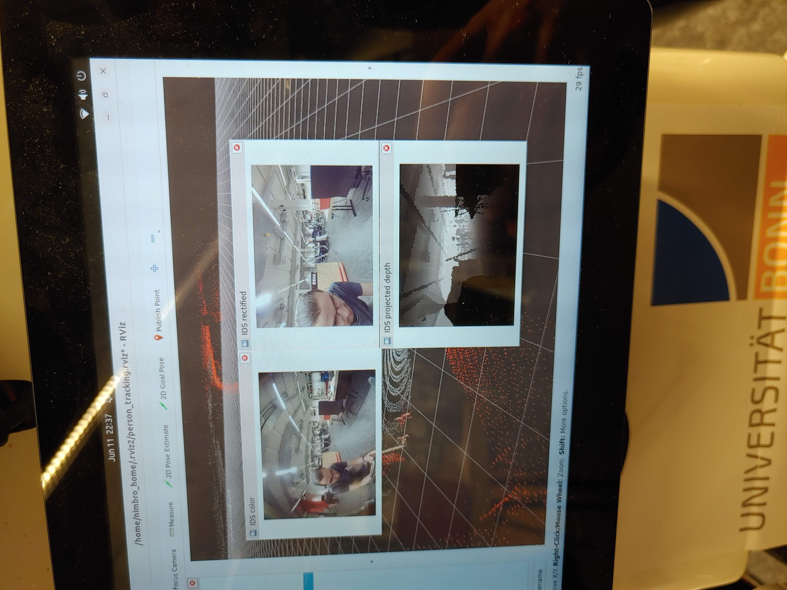

# ROS 2 Depth Interpolation

ROS 2 package for depth interpolation and point cloud coloring.

Note: This is a public, stripped-down version of a private repository. It may depend on other repositories which might not have a public version. Some paths, configurations, dependencies, have been removed or altered, so the code may not run out of the box.

|  |  |
| :---------------------------------------------------------: | :---------------------------------------------------------: |

*Figure 1: Point cloud coloring in real-time. Orange points are outside of the camera's FOV.*


*Figure 2: The camera is placed a little higher than the 3D LiDAR, so there are artifacts if objects occlude the measurements of one of the sensors, see the borders of the table.*

|  |  |
| :---------------------------------------------------------: | :---------------------------------------------------------: |

*Figure 3: Dense depth estimation for the fisheye lense camera using knn interpolation on point cloud from 3D LiDAR.*

|                                                |                                          |
| :---------------------------------------------------------------------------------------------: | :---------------------------------------------------------------------------------------: |
| *Figure 4: Comparison of interpolated depth and measured depth using a stereo IR depth camera.* | *Figure 5: Rectification and pixel-aligned depth from interpolation. Using an large FOV.* |

|  |  |
| :-----------------------------------------------: | :-----------------------------------------------: |
|          *Figure 6: Using a medium FOV.*          |          *Figure 7: Using an small FOV.*          |

## Setup

```bash
git clone https://github.com/bertan-karacora/ros2_depth_interpolation.git
cd ros2_depth_interpolation
colcon build --packages-select ros2_depth_interpolation
```

## Installation

### Build container

```bash
container/build.sh
```

## Usage

```bash
ros2 launch ros2_depth_interpolation depth_interpolation_launch.py
```

## Links

- [The Double Sphere Camera Model](https://arxiv.org/pdf/1807.08957)

## TODO

- Disantagle ROS 2 interface and interpolation pipeline
